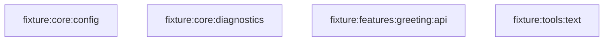
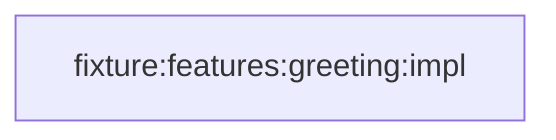
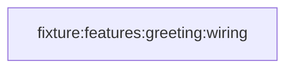
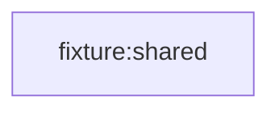
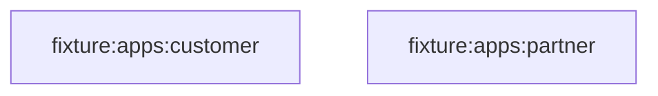

# Build waves

[← Module report](README.md) · generated by `./gradlew graph`

A wave is everything that can compile at once: wave 0 depends on no other module, and each
later wave waits only for the ones before it. The build is at least this many steps deep no
matter how many cores are available, so a deep graph is a slow graph.

Read the code in the same order. Wave 0 stands on its own; by the time you reach a later
wave you have already seen everything it builds on.

| Wave | Parallel |
|---:|---:|
| 0 | 4 |
| 1 | 1 |
| 2 | 1 |
| 3 | 1 |
| 4 | 2 |

## Wave 0

4 modules, all buildable at the same time.

## Wave 1

1 modules, all buildable at the same time.

## Wave 2

1 modules, all buildable at the same time.

## Wave 3

1 modules, all buildable at the same time.

## Wave 4

2 modules, all buildable at the same time.

[← Module report](README.md)
