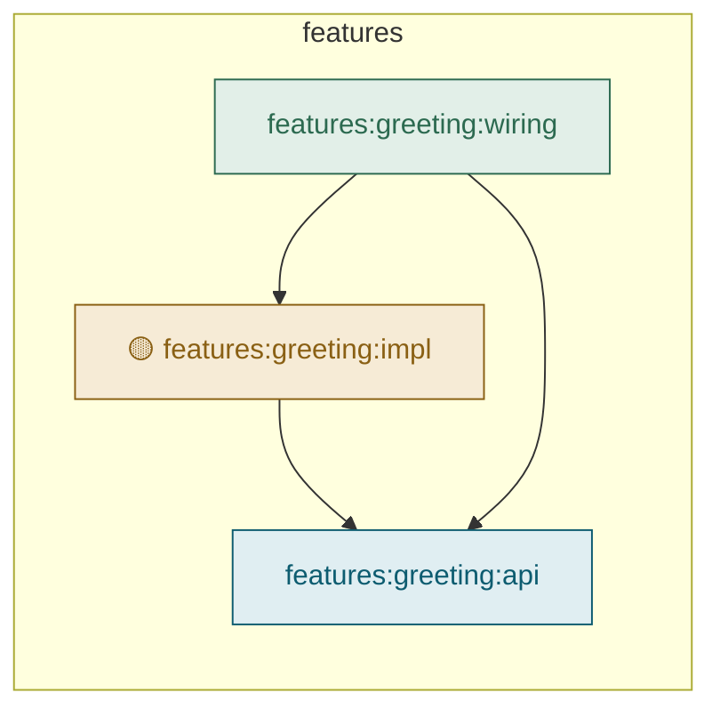

# Features

[← Module report](README.md) · generated by `./gradlew graph`

Modules under `features/`, grouped by owner.

An arrow points from a module to one it depends on. Node fill marks the role, and a 🔴 or 🟡
repeats the verdict from [Health](health.md).

[← Module report](README.md)
